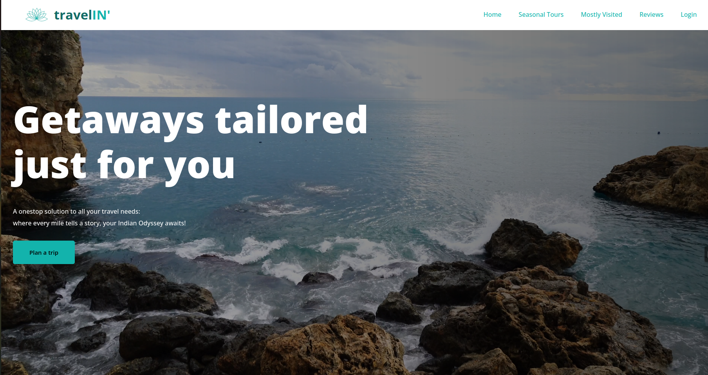
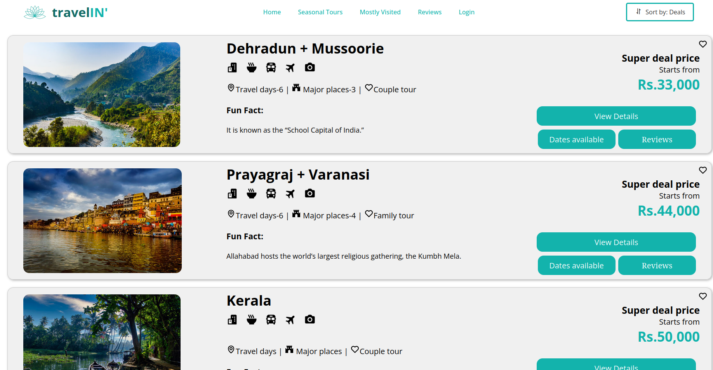
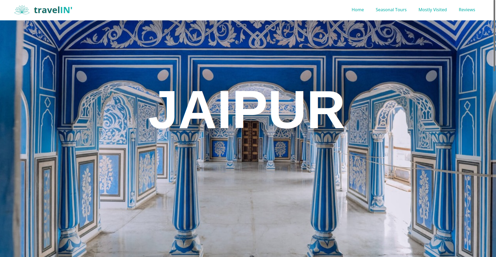

# 🌍 Travel-IN – Smart Travel Planning Website ✈️  

## About Travel-IN  
**Travel-IN** is a smart travel planning website built to simplify and personalize the way people explore India. It offers tailored itineraries and destination suggestions, allowing users to plan trips effortlessly and make their travel experience memorable. 🏞️✨



## ✨ Features  
- 📅 Personalized itineraries based on user preferences  
- 🏯 Destination highlights, cultural insights, and travel guides  
- 🍽️ Recommendations for places to eat, visit, and explore  
- 🖥️ Simple, responsive UI for a seamless experience on any device  

  


## 🛠️ Technologies Used  
- **HTML** – Structure of the website  
- **CSS** – Styling and responsive layout  
- **JavaScript** – Interactivity and dynamic content  

## 🚀 Installation & Usage  
To run this project locally:

```bash
git clone https://github.com/Saniya047/Travel-IN.git
```

Then, navigate into the project folder and open `index.html` in your browser.

## 👩‍💻 Developed By  
**Saniya Saini**  
Frontend enthusiast 

## 📩 Contact  
For suggestions or queries, feel free to reach out:  
📧 [sainisaniya047@gmail.com]

---

> ⭐ Don't forget to star the repository if you like it!

